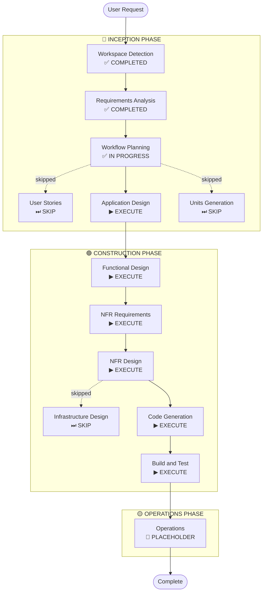

# Execution Plan

## Detailed Analysis Summary

### Change Impact Assessment
- **User-facing changes**: Yes — entirely new game application with full UI
- **Structural changes**: Yes — new project, all components created from scratch
- **Data model changes**: Yes — game state, score, physics model
- **API changes**: N/A — no external APIs; internal component interfaces only
- **NFR impact**: Yes — 60 FPS performance target, security extension enabled

### Risk Assessment
- **Risk Level**: Low
- **Rollback Complexity**: Easy (greenfield, no existing system to break)
- **Testing Complexity**: Moderate (game loop timing, collision detection, audio fallback)

---

## Workflow Visualization



### Text Alternative
```
INCEPTION PHASE:
  [x] Workspace Detection       - COMPLETED
  [x] Requirements Analysis     - COMPLETED
  [x] Workflow Planning         - IN PROGRESS
  [-] User Stories              - SKIP (single user type, no complex personas)
  [ ] Application Design        - EXECUTE
  [-] Units Generation          - SKIP (single cohesive unit)

CONSTRUCTION PHASE (single unit: Flappy Kiro macOS App):
  [ ] Functional Design         - EXECUTE
  [ ] NFR Requirements          - EXECUTE
  [ ] NFR Design                - EXECUTE
  [-] Infrastructure Design     - SKIP (local desktop app, no cloud infra)
  [ ] Code Generation           - EXECUTE
  [ ] Build and Test            - EXECUTE

OPERATIONS PHASE:
  [-] Operations                - PLACEHOLDER
```

---

## Phases to Execute

### 🔵 INCEPTION PHASE
- [x] Workspace Detection — COMPLETED
- [x] Requirements Analysis — COMPLETED
- [x] Workflow Planning — IN PROGRESS
- [-] User Stories — **SKIP**
  - **Rationale**: Single-player arcade game with one user type (the player). No complex personas, no acceptance criteria ambiguity, no cross-functional team collaboration needed.
- [ ] Application Design — **EXECUTE**
  - **Rationale**: New project with multiple new components (game loop, physics engine, renderer, input handler, audio manager, UI screens). Component responsibilities and interfaces need definition before coding.
- [-] Units Generation — **SKIP**
  - **Rationale**: Single cohesive deliverable — one macOS app. No decomposition into multiple independent units needed.

### 🟢 CONSTRUCTION PHASE (Unit: Flappy Kiro macOS App)
- [ ] Functional Design — **EXECUTE**
  - **Rationale**: Game physics (gravity, velocity), collision detection logic, scoring system, and difficulty curve algorithm need detailed design before implementation.
- [ ] NFR Requirements — **EXECUTE**
  - **Rationale**: 60 FPS performance target defined; Security Baseline extension is enabled and requires NFR assessment.
- [ ] NFR Design — **EXECUTE**
  - **Rationale**: Follows NFR Requirements. Security patterns (error handling, fail-safe defaults, exception handling per SECURITY-15) need to be incorporated into design.
- [-] Infrastructure Design — **SKIP**
  - **Rationale**: Local macOS desktop application. No cloud infrastructure, no deployment architecture, no network resources.
- [ ] Code Generation — **EXECUTE** (always)
- [ ] Build and Test — **EXECUTE** (always)

### 🟡 OPERATIONS PHASE
- [-] Operations — PLACEHOLDER (future expansion)

---

## Success Criteria
- **Primary Goal**: Fully playable Flappy Kiro game running natively on macOS
- **Key Deliverables**:
  - Swift/SwiftUI macOS application
  - Programmatic rendering (Catppuccin palette, Sora + JetBrains Mono fonts)
  - Audio: programmatic where possible, fallback to provided .wav assets
  - Game Over screen with score + restart
  - Progressive difficulty (speed increases with score)
- **Quality Gates**:
  - Game runs at stable 60 FPS
  - All Security Baseline rules evaluated (applicable ones compliant)
  - Build succeeds and game launches on macOS
